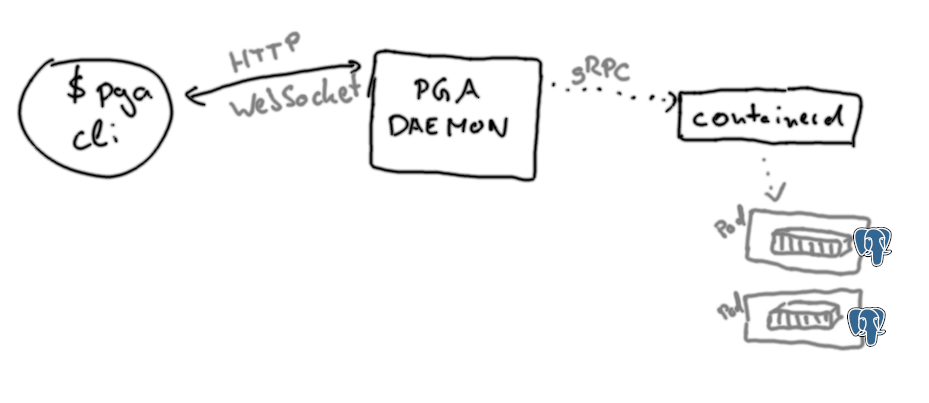

PGA leverages the power of containers to manage Postgres instances in an effective, user-friendly way.
Users don't need to have a container engine such as Docker installed on their system -- PGA installs in a self-sufficient way.

Internally, PGA installs a local containerd instance that doesn't interfere with your existing container runtimes (or lack thereof).
This makes the experience as transparent as possible for the user.

## Components

<!-- TODO make nicer image -->

### PGA Daemon

The central component is the PGA daemon which consists of the PGA application running in server mode (`pga --server`).
The daemon internally communicates with the containerd installation via gRPC, to manage the Postgres instances that are started via pods and containers.
The daemon also offers a REST API (default address `localhost:54321`), which the PGA CLI uses to manage the Postgres instances.

### PGA CLI

The PGA CLI (command line) offers the PGA functionality on the command line.
It communicates with the PGA daemon via REST.

### Containerd

The containerd installation is created at install time and runs the Postgres instances as containers.
